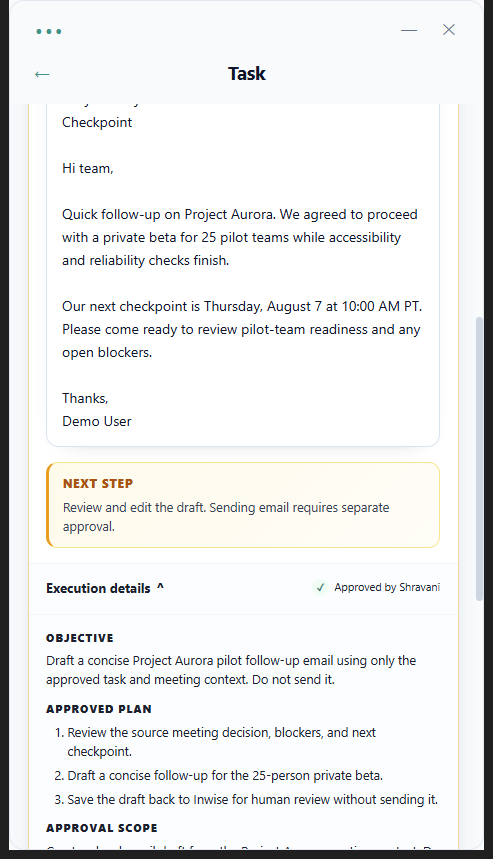
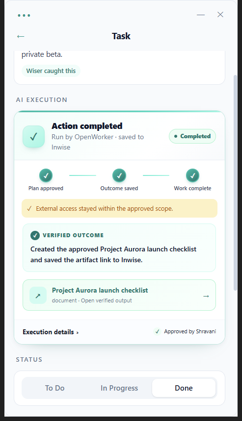

# Inwise — Local-First Meeting Intelligence

AI-powered meeting recorder that runs primarily on your machine. Your audio and transcripts stay local; extracted work can leave the app only through integrations you explicitly connect, such as your LLM, Jira, Zoom, or Slack.

**[Download Inwise for Windows](https://github.com/Wise-Ai-Org/inwise-opensource/releases/latest/download/Inwise-Setup-Windows.exe)** · [See the product and screenshots](https://inwise.ai/desktop?utm_source=github&utm_medium=readme&utm_campaign=oss_release) · [Use the hosted workspace](https://inwise.ai/signup?source=github-readme&utm_source=github&utm_medium=readme&utm_campaign=oss_release)

- **Local transcription** via [whisper.cpp](https://github.com/ggerganov/whisper.cpp) — no audio ever leaves your device
- **Local speaker voiceprints** via MFCC — identifies who said what, then auto-names it next time
- **Local storage** — NeDB single-file databases, all in your user profile directory
- **Your own LLM key** — Claude (Anthropic) or OpenAI for action-item extraction, transcript summaries, and insights
- **Your own calendars** via ICS feed — Google, Outlook, or any provider that exposes a secret ICS URL
- **Native transcript imports** — manually pull completed Zoom, Microsoft Teams, or Google Meet transcripts with your own provider credentials
- **Welcome-back screen** — when you return after a gap, the app tells you what it handled for you instead of piling work on you
- **Jira integration** — auto-push action items to stories, optional daily pull
- **Slack integration** — one-click browser authorization, local channel ingestion, and explicit recap sharing
- **Local AI access** — connect Claude, Codex, OpenWorker, or another MCP client to search meetings, prepare agendas, and follow up on action items without uploading an Inwise database; optionally write approved execution outcomes back to the originating task ([setup guide](https://github.com/Wise-Ai-Org/inwise-opensource/blob/v1.7.1/docs/openworker.md))

---

## Requirements

- **Windows 10/11** or **macOS 13 Ventura or later** (Apple Silicon and Intel)
- **Node.js 22+** for source builds (CI uses Node.js 24)
- **macOS source builds only:** Xcode Command Line Tools and CMake, used to compile the bundled whisper.cpp runtime
- **An Anthropic or OpenAI API key** — you bring your own; nothing routes through Inwise servers
- **Access to a secret ICS URL** from at least one calendar (Google / Outlook / other)

---

## Install

### Download the desktop app

- [Download Inwise for Windows](https://github.com/Wise-Ai-Org/inwise-opensource/releases/latest/download/Inwise-Setup-Windows.exe)
- [Download the latest macOS build](https://github.com/Wise-Ai-Org/inwise-opensource/releases/latest)

The packaged app supports Windows 10/11 and macOS 13 or later. The repository release
page includes versioned Windows, Apple Silicon, and Intel artifacts when they are
available for the current release.

### Build from source

```shell
git clone https://github.com/Wise-Ai-Org/inwise-opensource.git
cd inwise-opensource
npm ci
```

On Windows:

```shell
npm run build
npm start
```

On macOS:

```shell
npm run build:whisper:mac
npm run verify:whisper:mac
npm run build
npm start
```

The Windows app downloads its whisper.cpp runtime on first use. The macOS runtime is compiled for the current Mac by `build:whisper:mac`, checksum-verified by `verify:whisper:mac`, and included in release builds. Both platforms download your selected Whisper model on first use (~150 MB for `base`, ~750 MB for `medium`).

The shared TypeScript package is vendored in `src/shared`, so a normal clone contains everything required to install, test, and build the app.

To use Inwise from OpenWorker, follow the [OpenWorker setup guide](./docs/openworker.md). The connection stays on this computer. The original tool set is read-only; development builds can separately opt into [approval-aware action execution](./docs/action-execution.md).

### Close the Loop with Claude, Codex, or OpenWorker

Open an action item in your AI client, review the source-grounded plan, and approve its
exact scope. The client performs any approved external work and writes the verified
outcome, artifacts, and status back to the originating Inwise task. Inwise keeps the
approval and execution history locally; action writeback is off until you enable it.





To import provider-generated transcripts without running the local recorder, follow the [Teams and Google Meet setup guide](./docs/setup-teams-meet-transcripts.md). Zoom setup is available directly in Settings.

---

## First-run permissions walkthrough

Inwise needs three OS-level permissions. If any are missing or silently denied, the app will flag it on the Record Meeting pill with an amber dot and a tooltip explaining which one is broken.

### Windows
1. **Microphone** — Windows Settings → Privacy → Microphone → "Let desktop apps access your microphone" → **On**
2. **Screen recording / system audio** — when you hit Record Meeting the first time, Windows may prompt for desktopCapturer permission; allow it. Without this, other participants' voices won't be captured and your transcripts will only contain what your mic picked up
3. **Notifications** — Windows Settings → Notifications → "Inwise" → **On**. Used for "meeting starting" reminders and for alerting you mid-call if audio capture breaks

### macOS
1. **Microphone** — System Settings → Privacy & Security → Microphone → **Inwise: On**
2. **Screen & System Audio Recording** — System Settings → Privacy & Security → Screen & System Audio Recording → **Inwise: On** (called **Screen Recording** on macOS 13; required to capture other meeting participants)
3. **Notifications** — System Settings → Notifications → **Inwise: On** for meeting reminders and recording-health alerts

If you don't see Inwise listed, launch the app once, trigger the feature that needs the permission, and macOS will prompt you.

---

## Getting started

On first launch, three short steps collect the same setup without overwhelming you:

1. **Make Inwise yours** — add your name, choose local transcription quality, connect your Anthropic or OpenAI key, and optionally record a 10-second voice sample.
2. **Connect your work** — optionally connect Zoom and Slack in one click, choose Slack read/write channels, or expand Calendar and Jira. Zoom imports only completed transcripts you choose; Slack reads and posts only in approved channels.
3. **Start with context** — optionally load sample data, review what is connected, and open the local app.

Recordings, transcripts, settings, and imported content are stored locally. Your chosen LLM processes transcript text when Inwise creates notes or recaps; passwords stay with the connected provider.

---

## Optional Slack integration

Open **Settings → Integrations → Slack** and click **Connect Slack**. Choose a workspace in the browser,
review Slack's permission screen, and click **Allow**. There is no Slack app to create and no token to paste.
After authorization, select the channels Inwise may read and the channels available for explicit recap sharing.

The managed Inwise Slack app uses Slack's standard web OAuth exchange, keeping its client secret out of the
open-source desktop. The default flow therefore uses Inwise's hosted broker only for that exchange. The desktop
supplies a one-time RSA public key; the broker stores only an
encrypted, ten-minute handoff and deletes it when claimed. The resulting `xoxp` token is stored in the desktop's
local config. Raw transcripts are never sent through the broker.

Self-hosted forks can either set `INWISE_SLACK_OAUTH_BROKER_URL` to their broker or expand
**Advanced: use your own Slack app or token** and provide an `xoxp` user token directly.

---

## Troubleshooting

### My transcript has everything attributed to me (the other person's voice is missing)
Your system-audio capture is silent. Either:
- The app being captured (Zoom/Teams/Meet) wasn't actively playing audio through your speakers at recording start, or
- The OS routed output to a different device than the active meeting output, or
- On macOS, Screen & System Audio Recording permission is disabled

Check: before your next call, look at the Record Meeting pill. An amber dot means audio health is degraded — hover for the specific reason. The app will also fire a desktop Notification mid-call if system audio drops.

**Quick fix:** make sure your meeting app uses the active system output, ensure someone is speaking, and use **Settings → Test System Audio**. On macOS, the test links directly to System Settings when permission was denied.

### My recording was cut short / died at 2 minutes
Older builds had a hardcoded 2-minute Whisper timeout. If your `dist/` was built before `e1eaad5` (Apr 22, 2026), rebuild with `npm run build`. The new timeout scales with audio length — up to 3.6 hours for very long calls.

### "Processing recording..." has been showing for 10+ minutes
The pipeline died silently. Check `app.log` in the platform data directory for the last `pipeline:start` line and what followed. The WAV file is preserved in its `recordings/` directory, so you can recover or transcribe it again.

### My calendar isn't syncing
Check `app.log` in the platform data directory for `calendar-watcher:poll` lines. If you see `got=0 events`, the ICS URL is wrong or your calendar has no upcoming items. Google secret ICS URLs can expire if you reset sharing or change your password — re-copy from Calendar settings.

### I came back after a month and my task list is empty
The staleness sweep auto-snoozes tasks that haven't been touched in 30+ days, aren't high-priority, and weren't mentioned in any meeting in the last 14 days. Go to **Tasks → Snoozed filter** and hit `[Bring back]` on anything that's still relevant. Nothing is ever deleted automatically.

### I want to report a bug
1. Open **Settings → Support → Export diagnostic bundle** (when available — see "Roadmap" below) — this zips your `app.log`, recent meeting metadata (redacted), and device info
2. Open an issue at [github.com/Wise-Ai-Org/inwise-opensource/issues](https://github.com/Wise-Ai-Org/inwise-opensource/issues) and attach the bundle

Until the diagnostic bundle ships, please attach:
- `app.log` from the platform data directory
- A description of what you expected vs. what happened
- The timestamp the bug occurred so I can grep logs

---

## Where your data lives

Meeting data remains on your machine. Network calls occur only for services you explicitly configure: your chosen
LLM, Jira, Zoom, Microsoft, Google, or Slack. Managed Slack OAuth additionally uses the short-lived token broker
described above.

The data directory is `%APPDATA%/inwise-opensource/` on Windows and `~/Library/Application Support/inwise-opensource/` on macOS.

| What | Path inside the data directory |
|---|---|
| Config (API key, calendars, preferences) | `config.json` |
| Meetings | `meetings.db` |
| Tasks | `tasks.db` |
| People + voiceprints | `people.db`, `voiceprints.db` |
| Raw recordings (stereo WAV) | `recordings/` |
| Whisper models | `whisper-models/` |
| Windows Whisper runtime | `whisper-bin/` |
| Log | `app.log` |

The packaged macOS Whisper runtime lives inside `Inwise.app/Contents/Resources/whisper/`. To reset the app completely, quit Inwise, delete the platform data directory above, and restart.

---

## AI Models & Licenses

The app ships with no pre-bundled AI models. On first use, Whisper model binaries are downloaded to the platform data directory's `whisper-models/` folder:

- **Whisper (OpenAI)** — MIT license. Runtime-downloaded; select `base` (~150 MB) or `medium` (~750 MB) on first launch. Runs entirely on your machine via [whisper.cpp](https://github.com/ggerganov/whisper.cpp)
- **LLM API keys** — bring your own Claude (Anthropic) or OpenAI key. These services' terms apply to API usage; your audio is never sent to Anthropic/OpenAI unless you explicitly ask for insights extraction

---

## Privacy posture

- **Audio** never leaves your machine. whisper.cpp runs as a local subprocess
- **Transcripts** are sent to your LLM of choice (Claude or OpenAI) *only* when you approve insights extraction, and only with your API key
- **Voiceprints** are MFCC vectors (~1 KB per person) stored in your local NeDB; they aren't audio samples and can't be used to reproduce anyone's voice
- **Calendar events** normally come from ICS URLs you paste. Teams/Meet OAuth is used only if you explicitly enable native transcript imports
- **Jira** integration uses OAuth stored in your config; tokens never leave your machine except in direct calls to your Jira instance
- **Keys and tokens at rest**: API keys and integration tokens are stored unencrypted in your user profile (`config.json` / `credentials.db`), protected by your OS user account's file permissions — the standard local-first tradeoff. Treat the app's data directory like you'd treat `~/.ssh`
- **Local MCP server** (Settings → Connect to AI): serves meetings, action items, people, and meeting-prep context to AI clients on this machine at `127.0.0.1:43117`. Ten tools are read-only. Three default-off tools can record a user-approved execution, outcome/artifact links, and a local task-status change; the connected AI client still owns all external tool calls. Meeting details return only a short transcript excerpt; full transcripts require a separate paginated tool call. Loopback-only with DNS-rebinding guards, but on a shared multi-user machine other OS accounts can reach loopback ports — turn it off in Settings there. See the [OpenWorker data-boundary notes](./docs/openworker.md#understand-the-data-boundary) and [action-execution test flow](./docs/action-execution.md).
- **Telemetry**: none yet. When it's added (see Roadmap) it'll be opt-in and diagnostic-only

---

## Roadmap

What's shipped:
- Local recording + stereo diarization
- Voice enrollment (MFCC) with auto-identification on repeated speakers
- Multi-calendar subscription (N ICS URLs, any provider)
- Task lifecycle: todo / inProgress / done / snoozed / bring-back
- Welcome-back screen after long gaps (helper-voice, one ask max)
- Simultaneous-meeting conflict modal
- Jira auto-push and daily pull
- Action-item completion inference from transcripts (soft flag, never auto-closes)
- Manual native transcript import from Zoom, Microsoft Teams, and Google Meet

What's next:
- **Auto-updater** (electron-updater against GitHub releases)
- **Error logging + diagnostic bundle export** for bug reports
- **Mobile companion** (view-only, reads from the same local store via sync)
- **Encrypted cloud backup** with user-held keys (opt-in)

---

## Contributing

Small PRs welcome. For bigger changes, please open an issue first so we can align on approach. The codebase uses Electron 43, TypeScript, React 18, Chakra UI, NeDB for storage, and whisper.cpp for transcription. `npm test` runs the main-process suite; `npm run build` typechecks and bundles the full application. A manual test plan lives in [TEST_PLAN.md](./TEST_PLAN.md). Release signing is documented for [Windows](./docs/windows-release.md) and [macOS](./docs/macos-release.md).

---

## License

MIT © [Inwise.ai](https://inwise.ai)
